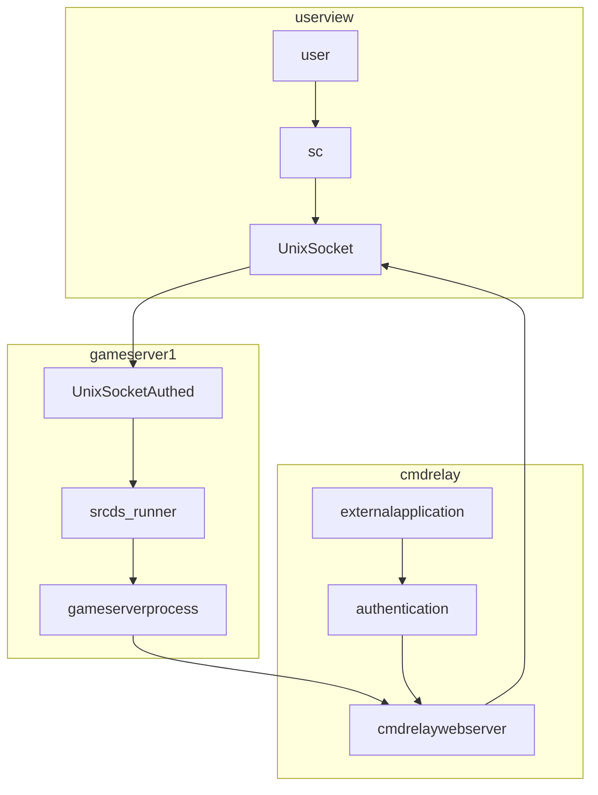

# Rewrite v0

## Goals

* Use UNIX sockets for easier authentication (by UID and GIDs of users)

## Architecture



## Sockets

Use Unix sockets for communication instead of listener.
This would allow each server to be have fine granular access control based on user and group IDs.

```go
uCred, err = unix.GetsockoptUcred(int(fd),
	unix.SOL_SOCKET,
	unix.SO_PEERCRED)
```

### Server Command Relay

The Server Command realy could just directly talk with the socket as well, as long as the process is the right user / in the right group.

## Structure

Each gameserver has its own config `.srcds_controller.yaml` file. The config file marks the base path for the gameserver.
